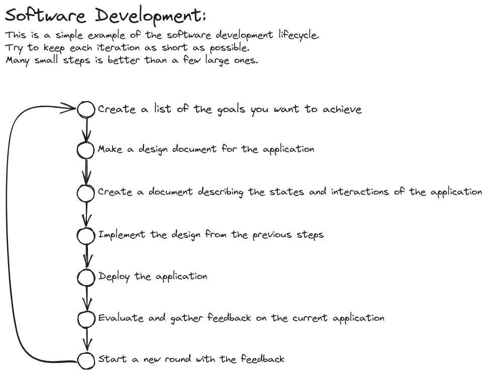

# Example React Application<br>*- The Pokedex*

## Content

- [Run this project locally](#run-this-project-locally)
- [Goals](#goals)
- [Design Documents](#design-documents)
- [References](#references)

## Run this project locally

1. Clone repository<br> ```git clone https://github.com/LarsGJobloop/example-pokedex.git```

## Goals

Showcasing how a single iteration in the development of an application can look like.

### The user should

- Be able to view a list of pokemons
  - Be able to navigate through all pokemons provided by the backend
- See details about a specific pokemon

### Skills applied

- Using Figma to create an application design
- Modeling of a application
- Setting up a project with Vite
- Using React to:
  - Create components from Figma design
  - Generating components from data
  - Interact with a backend
  - Create custom hooks for application specific functionality
- Using React Router to:
  - Create pages
  - Define layouts
  - Create pages based on URL state and parameters
- Setup tools for static code analysis (linting with [ESLint](https://eslint.org/))
- Setup a deploy pipeline

#### Stretch Goals

- Setup tools for dynamic program analysis (Unit Testing with [Vitest](https://vitest.dev/), [walkthrough](https://www.robinwieruch.de/vitest-react-testing-library/))
- Setup a basic [CI pipeline](https://www.redhat.com/en/topics/devops/what-cicd-pipeline) through [GitHub Actions](https://docs.github.com/en/actions/quickstart)

## Design Documents

### UI Design

[UI Design Documents](./docs/ui-design/ui-design.md)

### Architecture

[Architecture Documents](./docs/architecture/application-architecture.md)

### Project

A overview of the development cycle for this project.



## References

- [ViteJS](https://vitejs.dev/)
- [React](https://react.dev/)
- [React Router](https://reactrouter.com/)
- [ESLint](https://eslint.org/)
- [Deployment Choice]()