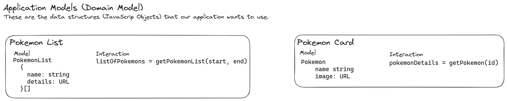
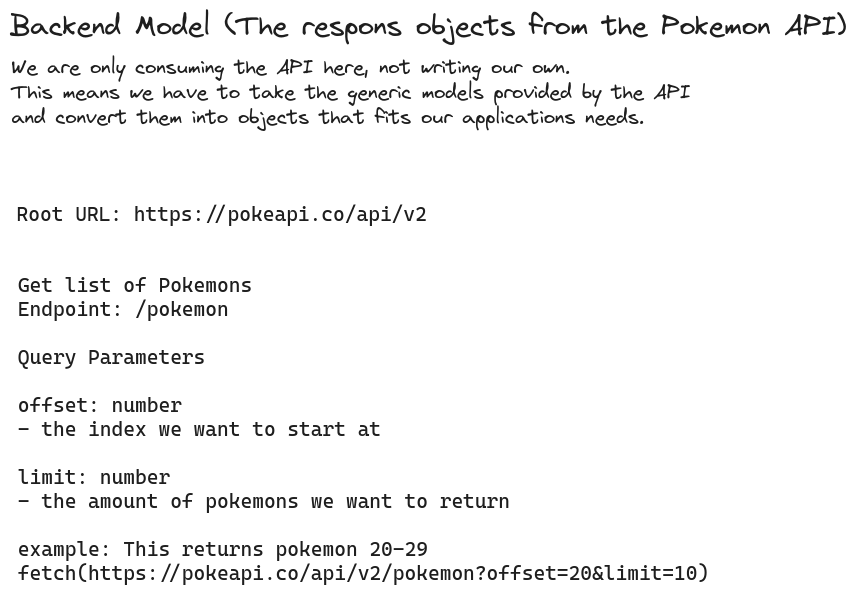
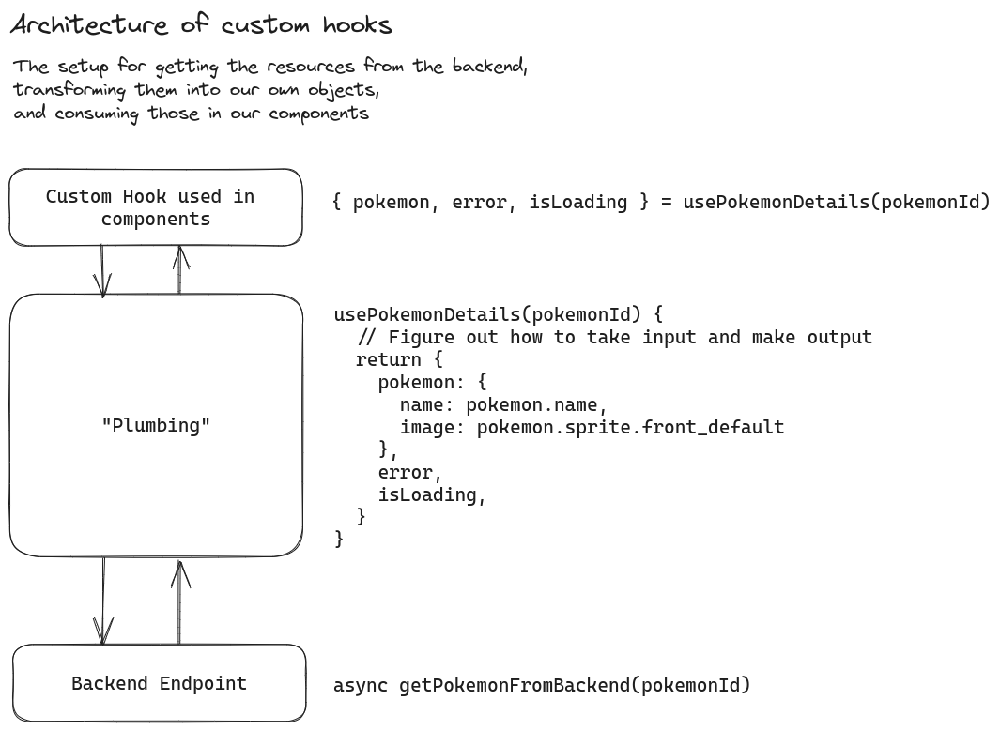

# Application Architecture

Design documents for how to structure our application.

## Application Models

The models and interactions we have identified.

## Backend Interaction

Overview of how we interact with the backend.

## Hooks Design

How we have decided link the frontend to the backend.

